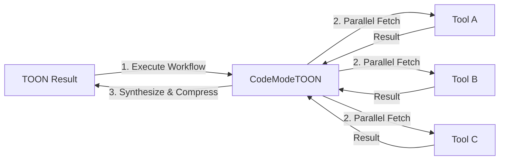

# CodeModeTOON Workflows

## Table of Contents
- [What Are Workflows?](#what-are-workflows)
- [Quick Start](#quick-start)
- [Available Workflows](#available-workflows)
  - [Research](#research-workflow)
  - [Chaos Monkey](#chaos-monkey-workflow)
  - [K8s Detective](#k8s-detective-workflow)
  - [Post-Mortem](#post-mortem-workflow)
- [🤖 AI Assistant Prompts](#-ai-assistant-prompts)
- [Advanced Usage](#advanced-usage)
- [Creating Custom Workflows](#creating-custom-workflows)
- [FAQ](#faq)

## What Are Workflows?

Workflows are pre-built, server-side TypeScript modules that orchestrate multiple MCP tools to perform complex tasks. Unlike single tool calls, workflows can:
- **Execute in Parallel**: Run multiple tools simultaneously (e.g., fetch from 3 sources at once).
- **Maintain State**: Pass data between steps without round-tripping to the LLM.
- **Handle Logic**: Implement retry loops, conditional branching, and error handling.
- **Compress Output**: Use TOON compression to return massive datasets efficiently.



## Quick Start

**Goal**: Compare two libraries using the `research` workflow.

```javascript
// Run this via execute_code
const result = await workflows.research({
  goal: "Compare xsync vs sync.Map performance in Go",
  queries: ["xsync vs sync.Map benchmarks", "xsync memory usage"],
  synthesize: true
});

console.log(result.synthesis);
```

## Available Workflows

### Research Workflow
**Name**: `research`  
**Purpose**: Gather and synthesize technical information from multiple sources (Context7, Wikipedia, Perplexity).

#### Parameters
| Parameter | Type | Required | Description |
|-----------|------|----------|-------------|
| `goal` | `string` | Yes | Primary objective (e.g., "Analyze React state libraries") |
| `libraryIDs` | `string[]` | No | Context7 library IDs (e.g., `["facebook/react"]`) |
| `wikipediaTopics` | `string[]` | No | Wikipedia titles (e.g., `["Virtual DOM"]`) |
| `queries` | `string[]` | No | Perplexity questions (e.g., `["React vs Vue performance"]`) |
| `synthesize` | `boolean` | No | If `true`, uses LLM to summarize findings. Default: `false` |
| `outputFile` | `string` | No | Path to save TOON result (e.g., `/tmp/research.toon`) |

#### Usage Example
```javascript
const result = await workflows.research({
  goal: "Understand Raft consensus",
  wikipediaTopics: ["Raft (algorithm)"],
  queries: ["Raft leader election timeout best practices"],
  synthesize: true
});
```

---

### Chaos Monkey Workflow
**Name**: `chaos-monkey`  
**Purpose**: Test system resilience by randomly stopping Docker containers.

#### Parameters
| Parameter | Type | Required | Description |
|-----------|------|----------|-------------|
| `outputFile` | `string` | Yes | Path to save the report (e.g., `/tmp/chaos_report.md`) |
| `dryRun` | `boolean` | No | If `true`, only simulates the attack. Default: `false` |
| `exclude` | `string[]` | No | Containers to ignore (e.g., `["database"]`) |

#### Usage Example
```javascript
// Run a dry run first
const report = await workflows['chaos-monkey']({
  outputFile: "/tmp/chaos_test.md",
  dryRun: true,
  exclude: ["production-db"]
});
console.log(report);
```

---

### K8s Detective Workflow
**Name**: `k8s-detective`  
**Purpose**: Audit Kubernetes clusters for security, efficiency, and stability.

#### Parameters
| Parameter | Type | Required | Description |
|-----------|------|----------|-------------|
| `outputFile` | `string` | Yes | Path to save TOON-compressed data |
| `namespace` | `string` | No | Target namespace. Default: All namespaces |

#### Usage Example
```javascript
const report = await workflows['k8s-detective']({
  outputFile: "/tmp/cluster_audit.toon",
  namespace: "production"
});
console.log(report);
```

#### Sample Output
```markdown
## Cluster audit review

### Overall status
- 10 pods across 2 namespaces
- 2 deployments (my-app, coredns)
- All pods are currently Running, but many have high restart counts

### Critical findings
1. **Stability**: High restart counts on kube-system pods (storage-provisioner: 31 restarts)
2. **Security**: Privileged container found in kube-proxy (expected)
3. **Efficiency**: 8 pods missing resource limits

### Recommendations
1. Add resource limits to all pods
2. Investigate storage-provisioner restarts
```

---

### Post-Mortem Workflow
**Name**: `post-mortem`  
**Purpose**: Analyze log files to generate an automated incident report.

#### Parameters
| Parameter | Type | Required | Description |
|-----------|------|----------|-------------|
| `logFile` | `string` | Yes | Path to log file (e.g., `/var/log/app.log`) |
| `outputFile` | `string` | Yes | Path to save report |

#### Usage Example
```javascript
const report = await workflows['post-mortem']({
  logFile: "/var/log/nginx/error.log",
  outputFile: "/tmp/incident_report.md"
});
console.log(report);
```

## 🤖 AI Assistant Prompts

Copy these prompts to teach your AI assistant how to use workflows effectively.

### General Workflow Prompt
```text
SYSTEM CONTEXT: You have access to CodeModeTOON's workflow system via the `execute_workflow` tool. Workflows are pre-built, optimized sequences that combine multiple MCP tools for common tasks.

AVAILABLE WORKFLOWS:
1. `research` - Multi-source research with parallel execution
2. `chaos-monkey` - Docker resilience testing
3. `k8s-detective` - Kubernetes cluster auditing
4. `post-mortem` - Log analysis and incident reports

WHEN TO USE WORKFLOWS:
- ✅ Use for complex, multi-step tasks
- ✅ Use when you need data from multiple sources
- ✅ Use for automated analysis/reporting
- ❌ Don't use for simple single-tool queries

EXECUTION PATTERN:
Use the `execute_workflow` tool with the `workflowName` and `parameters` object.
```

### Research Workflow Prompt
```text
Use the `research` workflow when I ask for a deep dive or comparison.
- Always set a specific `goal`.
- Use `synthesize: true` if I want a summary, `false` if I want raw data.
- Use `outputFile` if the result might be large.
```

### K8s Detective Prompt
```text
Use the `k8s-detective` workflow when I ask to "audit the cluster" or "check for issues".
- Always provide an `outputFile` path (e.g., `/tmp/audit.toon`).
- If I specify a namespace, use the `namespace` parameter.
```

## Advanced Usage

### Chaining Workflows
You can chain workflows by using the output of one as the input for another.

```javascript
// 1. Run Chaos Monkey
await workflows['chaos-monkey']({ outputFile: "/tmp/chaos.md", dryRun: false });

// 2. Wait for logs to accumulate
await new Promise(r => setTimeout(r, 5000));

// 3. Run Post-Mortem on the logs
const analysis = await workflows['post-mortem']({
  logFile: "/var/log/app.log",
  outputFile: "/tmp/post_chaos_analysis.md"
});
```

## Creating Custom Workflows

Create a new `.ts` file in the `.workflows` directory:

```typescript
import { WorkflowDefinition } from '../src/workflow-types.js';

export const workflow: WorkflowDefinition = {
    name: 'my-workflow',
    description: 'Description of what it does',
    parameters: {
        paramName: { type: 'string', description: '...', required: true }
    },
    execute: async (params, context) => {
        // Your logic here
        // Access tools via context.servers
        return "Result";
    }
};
```

## FAQ

**Q: Where are workflows stored?**  
A: In the `.workflows` directory of your project.

**Q: Can I modify existing workflows?**  
A: Yes, they are just TypeScript files. Edit them directly to change behavior.

**Q: Do workflows consume tokens?**  
A: The workflow logic runs server-side (0 tokens). Only the final output sent back to the AI consumes tokens (and it's TOON compressed!).
