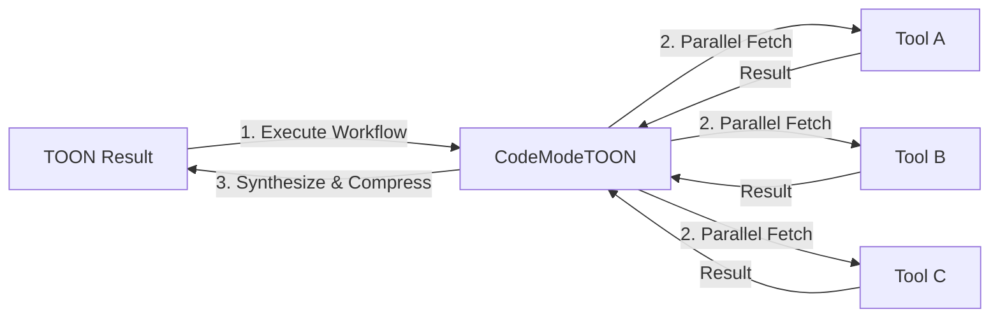

# CodeModeTOON Workflows

## Table of Contents
- [What Are Workflows?](#what-are-workflows)
- [Quick Start](#quick-start)
- [Available Workflows](#available-workflows)
  - [Research](#research-workflow)

  - [K8s Detective](#k8s-detective-workflow)
  - [Post-Mortem](#post-mortem-workflow)
- [🤖 AI Assistant Prompts](#-ai-assistant-prompts)
- [Advanced Usage](#advanced-usage)
- [Creating Custom Workflows](#creating-custom-workflows)
- [FAQ](#faq)

## What Are Workflows?

Workflows are pre-built, server-side TypeScript modules that orchestrate multiple MCP tools to perform complex tasks. Unlike single tool calls, workflows can:
- **Execute in Parallel**: Run multiple tools simultaneously (e.g., fetch from 3 sources at once).
- **Maintain State**: Pass data between steps without round-tripping to the LLM.
- **Handle Logic**: Implement retry loops, conditional branching, and error handling.
- **Compress Output**: Use TOON compression to return massive datasets efficiently.



## Quick Start

**Goal**: Compare two libraries using the `research` workflow.

```javascript
// Run this via execute_code
const result = await workflows.research({
  goal: "Compare xsync vs sync.Map performance in Go",
  queries: ["xsync vs sync.Map benchmarks", "xsync memory usage"],
  libraryIDs: ["puzpuzpuz/xsync"],
  wikipediaTopics: ["Hash table", "Synchronization (computer science)"],
  synthesize: true
});

console.log(result.synthesis);
```

## Available Workflows

### Research Workflow
**Name**: `research`  
**Purpose**: Comprehensive multi-source research aggregator (Context7, Wikipedia, Perplexity) with parallel execution and synthesis.

#### Parameters
| Parameter | Type | Required | Description |
|-----------|------|----------|-------------|
| `goal` | `string` | Yes | Primary objective (e.g., "Analyze React state libraries") |
| `libraryIDs` | `string[]` | No | Context7 library IDs (e.g., `["facebook/react"]`) |
| `wikipediaTopics` | `string[]` | No | Wikipedia titles (e.g., `["Virtual DOM"]`) |
| `queries` | `string[]` | No | Perplexity questions (e.g., `["React vs Vue performance"]`) |
| `synthesize` | `boolean` | No | If `true`, uses LLM to summarize findings. Default: `false` |
| `outputFile` | `string` | No | Path to save TOON result (e.g., `/tmp/research.toon`) |
| `batchSize` | `number` | No | Max parallel requests per source. Default: `5` |

#### Usage Example
```javascript
const result = await workflows.research({
  goal: "Understand CodeModeTOON MCP orchestrator - what it is, how it works, key features like TOON compression, lazy-loading, and when to use it for AI coding assistants",
  queries: [
    "What is Model Context Protocol (MCP) and how does it work with AI assistants?",
    "What are MCP servers and how do they extend AI assistant capabilities?",
    "What is TOON compression format for AI data efficiency?"
  ],
  wikipediaTopics: [
    "Model Context Protocol"
  ],
  synthesize: false
});
```

#### Sample Output
<details>
<summary>Click to view Research Workflow output</summary>

```
I'll use the research workflow to gather information about CodeModeTOON and then explain it to you. Let me first check the available workflows and then execute the research.

[2 tools called]

Now let me execute the research workflow to gather comprehensive information:

[3 tools called]

Let me also check what servers are available and get more details on the execute_code feature:

[2 tools called]

Excellent! Now I have all the research I need. Let me explain **CodeModeTOON** to you:

---

# 🚀 CodeModeTOON: Your AI Power-Up for Development

## What Is It?

**CodeModeTOON** is an **MCP orchestrator** — think of it as a smart "traffic controller" that sits between your AI assistant (like me, Claude) and multiple specialized tools/servers. It makes your AI coding assistant significantly more powerful by:

1. **Connecting to multiple MCP servers** (databases, APIs, development tools)
2. **Automatically compressing data** to save tokens and costs
3. **Lazy-loading servers** on demand (no startup overhead)
4. **Normalizing file paths** across Windows/Mac/Linux

---

## 🔑 Key Concepts

### What is MCP (Model Context Protocol)?
MCP is an **open standard** created by Anthropic that lets AI assistants securely connect to external tools and data sources. Instead of being limited to pre-trained knowledge, MCP enables AI to:
- Access real-time data (databases, APIs, file systems)
- Execute actions (run commands, modify files, query services)
- Use specialized tools (Kubernetes auditing, code analysis, web search)

### What Does CodeModeTOON Add?

| Feature | What It Does |
|---------|--------------|
| **TOON Compression** | Reduces structured JSON data by 30-90%, saving tokens/costs |
| **Lazy Loading** | Servers only start when you actually need them |
| **Unified Interface** | One consistent way to call any MCP tool |
| **Pre-Built Workflows** | Automated pipelines for common tasks |

---

## 🛠️ Available Tools

### Currently Loaded Servers:
- `go-development` — Go language tooling
- `workspace-lsp` — Language Server Protocol features
- `sequential-thinking` — Step-by-step reasoning
- `perplexity` — Web search and Q&A

### Available On-Demand (Lazy):
- `context7` — Library documentation lookup
- `structured-thinking` — Complex problem analysis

---

## 📋 Built-In Workflows

These are **pre-built automations** you can run with one command:

| Workflow | Purpose |
|----------|---------|
| **research** | Multi-source research from Perplexity, Wikipedia, library docs |
| **k8s-detective** | Kubernetes cluster security and health auditing |
| **post-mortem** | Log analysis with pattern clustering and anomaly detection |
| **chaos-monkey** | System resilience testing via Docker container disruption |

---

## 🎯 When to Use What

| Scenario | Use This |
|----------|----------|
| Quick tool call | Direct MCP call |
| 3+ related operations | `execute_code` (batching) |
| Research, auditing, log analysis | `execute_workflow` |
| Finding tools | `search_tools` |
| Learning a server's API | `get_tool_api` |

---

## 🚦 Quick Start Steps

1. **`list_servers`** — See what's available
2. **`list_workflows`** — Discover automations
3. **`search_tools`** — Find specific capabilities
4. **`get_tool_api`** — Inspect tool parameters
5. **`execute_workflow`** or **`execute_code`** — Run your task

---

## 💡 Example: What Just Happened

When you asked me to research this tool, I used the **research workflow** which:
1. Queried Perplexity for MCP documentation
2. Ran multiple queries in parallel
3. Aggregated results automatically
4. Returned compressed, structured data

All of this happened through CodeModeTOON orchestrating the downstream MCP servers!

---

**In short:** CodeModeTOON turns your AI assistant from a "smart text generator" into a **capable agent** that can research, analyze, audit, and automate real development tasks. 🎉
```
</details>

---

### K8s Detective Workflow
**Name**: `k8s-detective`  
**Purpose**: Audit Kubernetes clusters for security, efficiency, and stability.

#### Parameters
| Parameter | Type | Required | Description |
|-----------|------|----------|-------------|
| `outputFile` | `string` | Yes | Path to save TOON-compressed data |
| `namespace` | `string` | No | Target namespace. Default: All namespaces |

#### Usage Example
```javascript
const report = await workflows['k8s-detective']({
  outputFile: "/tmp/cluster_audit.toon",
  namespace: "production"
});
console.log(report);
```

#### Sample Output
<details>
<summary>Click to view K8s Detective Workflow output</summary>

```
Re-running the k8s-detective workflow:


[1 tool called]


K8s Detective workflow completed. Audit report:

## Cluster overview
- **Pods:** 10
- **Deployments:** 2
- **Services:** 2
- **Events Analyzed:** 55

## Issue summary by severity
- **Critical:** 1
- **High:** 5
- **Medium:** 28
- **Low:** 5
- **Total Issues:** 39

## Critical issues
1. **SECURITY:** `kube-proxy-xv658/kube-proxy` — Container runs privileged (full host access)

## High severity issues
5 security issues — all kube-system pods using host network:
- `etcd-docker-desktop`
- `kube-apiserver-docker-desktop`
- `kube-controller-manager-docker-desktop`
- `kube-proxy-xv658`
- `kube-scheduler-docker-desktop`

## Medium severity issues (28)
- Security: `allowPrivilegeEscalation` not disabled (9 pods)
- Security: Using `:latest` or untagged image (nginx)
- Efficiency: No resource limits (8 pods)
- Stability: High restart counts:
  - `storage-provisioner`: 33 restarts
  - `kube-scheduler`: 23 restarts
  - `kube-controller-manager`: 20 restarts
  - CoreDNS pods: 15 restarts each
- Stability: CoreDNS pods showing "Unhealthy" warnings (4x each)

## Low severity issues (5)
- Efficiency: Missing resource requests (4 pods)
- Config: Single replica deployment (no HA)

## Notable changes from previous run
- Restart counts increased slightly (e.g., storage-provisioner: 31 → 33)
- Added event analysis (55 events)
- Better categorization with severity levels
- Identified CoreDNS "Unhealthy" warnings

The report has been saved to the output file.
```
</details>

---

### Post-Mortem Workflow
**Name**: `post-mortem`  
**Purpose**: Intelligent log analysis with streaming processing, pattern clustering, and anomaly detection.

#### Parameters
| Parameter | Type | Required | Description |
|-----------|------|----------|-------------|
| `logFile` | `string` | Yes | Path to log file (e.g., `/var/log/app.log`) |
| `outputFile` | `string` | Yes | Path to save TOON-compressed analysis |
| `maxExamples` | `number` | No | Max examples per cluster. Default: `5` |
| `includePatterns` | `boolean` | No | Include normal patterns in output. Default: `true` |

#### Sample Output
<details>
<summary>Click to view Post-Mortem Workflow output</summary>

```
Running the post-mortem workflow on `warning_alerts.log`:


[1 tool called]


Post-mortem workflow completed. Analysis of `warning_alerts.log`:

## Analysis results

**Statistics:**
- **Total Lines:** 899
- **Unique Patterns:** 1
- **Time Span:** ~5 seconds (15:43:20 - 15:43:25)
- **Peak Activity:** 899 events in 1 minute

### Issue breakdown
- **Critical:** 0
- **Errors:** 0
- **Warnings:** 899

## Critical findings

### Warning alert storm — same monitor
- **Monitor:** Ping Monitor 00100 (port 57426)
- **Status:** DEGRADED (not FAILED)
- **Severity:** WARNING
- **Color:** yellow
- **Job ID:** `001d1946-74ab-4c3d-8d2b-4cf5eb736598` (same for all 899 alerts)
- **Time Window:** 5.2 seconds
- **Alert Rate:** ~173 alerts/second

### Alert details
All 899 warnings contain:
- **Summary:** "Service health checks are failing consecutively beyond safe thresholds"
- **Action:** "Investigate partial outage or performance regression"
- **Next Steps:** "Validate dependencies, review recent changes, and monitor closely"

## Comparison with critical alerts

| Metric | Critical Alerts | Warning Alerts |
|--------|----------------|----------------|
| Count | 900 | 899 |
| Status | FAILED | DEGRADED |
| Severity | CRITICAL | WARNING |
| Time Span | 14 seconds | 5 seconds |
| Job ID | `cb2b2ca6-...` | `001d1946-...` |
| Alert Rate | ~64/sec | ~173/sec |

## Root cause analysis

### Observations
1. Same monitor, different severity: warnings likely preceded critical alerts.
2. Higher alert rate: warnings generated faster than criticals.
3. Same pattern: alert flooding without deduplication.
4. Escalation path: DEGRADED → FAILED suggests a progression.

### Timeline hypothesis
- 15:43:20-15:43:25: Warning alerts (DEGRADED)
- 09:22:08-09:22:22: Critical alerts (FAILED) — likely later escalation

## Recommendations

1. Immediate:
   - Check if port 57426 service is degraded or down
   - Review service health metrics

2. Alerting improvements:
   - Implement alert deduplication (same job_id + status = single alert)
   - Add rate limiting (max alerts per time window)
   - Implement alert state machine (WARNING → CRITICAL with suppression)
   - Add correlation between warning and critical alerts

3. Monitoring optimization:
   - Reduce check frequency during degraded states
   - Implement progressive alerting (fewer alerts as severity increases)
   - Add alert grouping by monitor + status

The workflow categorized this as a performance issue and identified the alert flooding pattern. The report was saved to the output file.
```
</details>

## 🤖 AI Assistant Prompts

Copy these prompts to teach your AI assistant how to use workflows effectively.

### General Workflow Prompt
```text
SYSTEM CONTEXT: You have access to CodeModeTOON's workflow system via the `execute_workflow` tool. Workflows are pre-built, optimized sequences that combine multiple MCP tools for common tasks.

AVAILABLE WORKFLOWS:
1. `research` - Multi-source research with parallel execution
2. `chaos-monkey` - Docker resilience testing
3. `k8s-detective` - Kubernetes cluster auditing
4. `post-mortem` - Log analysis and incident reports

WHEN TO USE WORKFLOWS:
- ✅ Use for complex, multi-step tasks
- ✅ Use when you need data from multiple sources
- ✅ Use for automated analysis/reporting
- ❌ Don't use for simple single-tool queries

EXECUTION PATTERN:
Use the `execute_workflow` tool with the `workflowName` and `parameters` object.
```

### Research Workflow Prompt
```text
Use the `research` workflow when I ask for a deep dive or comparison.
- Always set a specific `goal`.
- Use `synthesize: true` if I want a summary, `false` if I want raw data.
- Use `outputFile` if the result might be large.
```

### K8s Detective Prompt
```text
Use the `k8s-detective` workflow when I ask to "audit the cluster" or "check for issues".
- Always provide an `outputFile` path (e.g., `/tmp/audit.toon`).
- If I specify a namespace, use the `namespace` parameter.
```

## Advanced Usage

### Chaining Workflows
You can chain workflows by using the output of one as the input for another.

```javascript
// 1. Run Chaos Monkey
await workflows['chaos-monkey']({ outputFile: "/tmp/chaos.md", dryRun: false });

// 2. Wait for logs to accumulate
await new Promise(r => setTimeout(r, 5000));

// 3. Run Post-Mortem on the logs
const analysis = await workflows['post-mortem']({
  logFile: "/var/log/app.log",
  outputFile: "/tmp/post_chaos_analysis.md"
});
```

## Creating Custom Workflows

Create a new `.ts` file in the `.workflows` directory:

```typescript
import { WorkflowDefinition } from '../src/workflow-types.js';

export const workflow: WorkflowDefinition = {
    name: 'my-workflow',
    description: 'Description of what it does',
    parameters: {
        paramName: { type: 'string', description: '...', required: true }
    },
    execute: async (params, context) => {
        // Your logic here
        // Access tools via context.servers
        return "Result";
    }
};
```

## FAQ

**Q: Where are workflows stored?**  
A: In the `.workflows` directory of your project.

**Q: Can I modify existing workflows?**  
A: Yes, they are just TypeScript files. Edit them directly to change behavior.

**Q: Do workflows consume tokens?**  
A: The workflow logic runs server-side (0 tokens). Only the final output sent back to the AI consumes tokens (and it's TOON compressed!).
