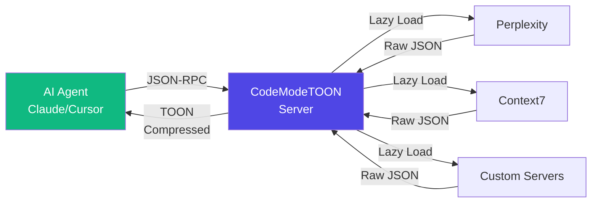

# CodeModeTOON MCP Server


A lightweight **Model Context Protocol (MCP)** orchestrator designed for **efficiency at scale**. It features **TOON compression** (reducing token usage by 30-70%) and **Lazy Loading**, making it the ideal solution for complex, multi-tool agentic workflows.

## The "Context Trap" in Agentic Workflows

Recent research from **Anthropic** and **Cloudflare** highlights a critical bottleneck: **AI agents struggle with complex, multi-step workflows because they lack state.**

While **Code Execution** (e.g., TypeScript) allows agents to maintain state and structure workflows effectively, it introduces a new problem: **Data Bloat**. Real-world operations (like SRE log analysis or database dumps) generate massive JSON payloads that explode the context window, making stateful execution prohibitively expensive.

**CodeModeTOON** bridges this gap. It enables:
1.  **Stateful Execution**: Run complex TypeScript workflows to maintain context *outside* the model.
2.  **Context Efficiency**: Use **TOON Compression** to "zip" the results, allowing agents to process massive datasets without blowing their token budget.

## How It Works


**Data Flow**: Requests route through CodeModeTOON → Servers are lazy-loaded on-demand → Responses are TOON-compressed before returning to the agent.

### 🔥 Key Features

#### 🗜️ TOON Compression
Reduces token usage by **30-90%** for structured data.
- **Validated**: 92% savings on Kubernetes audits
- **Best for**: SRE logs, database dumps, API responses
- **How it works**: Schema extraction + value compression

#### ⚡ Lazy Loading
Servers only start when needed. Zero overhead for unused tools.
- **Best for**: Multi-tool workflows, resource-constrained environments
- **Performance**: Sub-100ms startup for active servers

#### 🔒 Sandboxed Execution
Secure JS execution with auto-proxied MCP tool access.
- **Best for**: Complex stateful workflows, batch operations
- **Security**: Uses Node.js `vm` module (not for multi-tenant use)

## Table of Contents
- [The Context Trap](#the-context-trap-in-agentic-workflows)
- [How It Works](#how-it-works)
- [Key Features](#key-features)
- [When to Use](#when-to-use-codemodetoon)
- [Installation](#installation)
- [Quick Start](#quick-start)
- [Usage Examples](#usage-examples)
- [Workflows](#workflows)
- [Performance Benchmark](#performance-benchmark)
- [Troubleshooting](#troubleshooting)
- [Security](#security-note)
- [Contributing](#contributing)
- [License](#license)

## When to Use CodeModeTOON

**✅ Perfect for:**
- **Multi-step AI workflows** requiring state management
- **Processing large structured datasets** (logs, DB dumps, K8s manifests)
- **Coordinating multiple MCP servers** in parallel
- **Token-constrained environments** (reducing API costs)

**❌ Not ideal for:**
- Simple single-tool queries
- Unstructured text-heavy responses (compression <10%)
- Multi-tenant production servers (vm module security limitation)

## Installation

### One‑Click (Cursor)

[](https://cursor.com/en-US/install-mcp?name=code-mode-toon&config=eyJ0eXBlIjoic3RkaW8iLCJjb21tYW5kIjoibnB4IiwiYXJncyI6WyIteSIsImNvZGUtbW9kZS10b29uIl19)

### Manual Setup

Add this to your `~/.cursor/mcp.json`:

```json
{
  "mcpServers": {
    "code-mode-toon": {
      "type": "stdio",
      "command": "npx",
      "args": ["-y", "code-mode-toon"],
      "env": {
        "CODE_MODE_TOON_CONFIG": "~/.cursor/mcp.json"
      }
    }
  }
}
```


## Quick Start

After installation, try this 30-second demo in Claude or Cursor:

```javascript
// Ask your AI assistant to run this via execute_code
const api = await get_tool_api({ serverName: 'perplexity' });

const result = await servers['perplexity'].perplexity_ask({
  messages: [{ role: 'user', content: "Explain TOON compression" }]
});

console.log(result); // See compression in action! ~40% token savings
```

**What just happened?** The response was automatically TOON-encoded, saving tokens.

## Usage Examples

**1. Optimized Tool Execution with TOON Compression**

```javascript
// Inside execute_code
const api = await get_tool_api({ serverName: 'perplexity' });

// Request large data - automatically compressed!
const result = await servers['perplexity'].perplexity_ask({
  messages: [{ role: 'user', content: "Summarize the history of Rome" }]
});

console.log(result); // Returns TOON-encoded string, saving ~40% tokens
```

**2. Multi-Server Coordination**

```javascript
// Fetch large documentation from Context7
const api = await get_tool_api({ serverName: 'context7' });
const docs = await servers['context7']['get-library-docs']({
  context7CompatibleLibraryID: 'kubernetes/kubernetes'
});

console.log(TOON.encode(docs)); // Massive compression on structured data
```

**3. Workflow Orchestration**

```javascript
// Run a complex research workflow
const result = await workflows.research({
  goal: "Compare xsync vs sync.Map performance",
  queries: ["xsync vs sync.Map benchmarks"],
  synthesize: true,
  outputFile: "/tmp/research.toon"
});

console.log(result.synthesis); // LLM-synthesized findings
```

## Workflows

CodeModeTOON supports **Workflows**—pre-defined, server-side TypeScript modules that orchestrate multiple MCP tools.

### Research Workflow
A powerful research assistant that:
- **Parallelizes** data fetching from multiple sources (Context7, Wikipedia, Perplexity).
- **Synthesizes** findings using LLMs (optional).
- **Outputs TOON-encoded files** for maximum context efficiency.
- **Retries** failed requests automatically.

See [.workflows/WORKFLOWS.md](.workflows/WORKFLOWS.md) for detailed documentation, usage examples, and AI prompts.

## Performance Benchmark

### Why This Matters

**Scenario 2 (92% savings)** demonstrates CodeModeTOON's strength:

| Metric | Original | TOON | Savings |
|--------|----------|------|---------|
| Characters | 37,263 | 2,824 | 92.42% |
| Estimated Tokens* | ~9,315 | ~706 | 8,609 tokens |
| Cost (Claude Sonnet)** | $0.028 | $0.002 | $0.026 |

\**Assuming 4 chars/token average*  
\***$3/M tokens input pricing*

**Key Insight**: For infrastructure audits, log analysis, or database dumps, TOON compression can reduce token costs by 90%+, making complex agentic workflows feasible within budget.

### Detailed Scenarios

**Scenario 1: Natural Language Query (History of Rome)**
*Unstructured text compresses poorly, as expected.*
- **Original JSON**: 11,651 chars
- **TOON Encoded**: 11,166 chars
- **Compression Ratio**: **~4.16% Savings**

**Scenario 2: Kubernetes Cluster Audit (50 Pods)**
*Highly structured, repetitive JSON (infrastructure dumps) compresses extremely well.*
- **Original JSON**: 37,263 chars
- **TOON Encoded**: 2,824 chars
- **Compression Ratio**: **92.42% Savings** 📉

## Troubleshooting

### "Server not found" error
**Cause**: CodeModeTOON can't locate your MCP config.
**Solution**: Ensure `CODE_MODE_TOON_CONFIG` points to your config:
```bash
export CODE_MODE_TOON_CONFIG=~/.cursor/mcp.json
```

### TOON encoding not working
**Cause**: Results aren't being encoded.
**Solution**: Use `console.log(TOON.encode(data))`, not `console.log(data)`.

### Lazy server won't load
**Cause**: Server name mismatch.
**Solution**: Verify server name matches your config. Use `get_tool_api({ serverName: 'name' })` to inspect available servers.

## Security Note

**⚠️ The `vm` module is NOT a security sandbox.** Suitable for personal AI assistant use (Claude, Cursor) with trusted code. Not for multi-tenant or public services.

## Acknowledgments
- Anthropic: [Code execution with MCP](https://www.anthropic.com/engineering/code-execution-with-mcp)
- Cloudflare: [Code Mode announcement](https://blog.cloudflare.com/code-mode/)

## Author
Built by **Ziad Hassan** (Senior SRE/DevOps) — [LinkedIn](https://www.linkedin.com/in/ziad-hassan-334688216/) · [GitHub](https://github.com/ziad-hsn)

## Contributing

We welcome contributions! 🙌

### Ways to Contribute
1. **Report bugs** - Open an issue with reproduction steps
2. **Suggest features** - Discuss use cases in Issues
3. **Add workflows** - See [WORKFLOW_DESIGN.md](WORKFLOW_DESIGN.md)
4. **Improve docs** - Documentation PRs always welcome

### Development Setup
```bash
git clone https://github.com/ziad-hsn/code-mode-toon.git
cd code-mode-toon
npm install
npm test
```

## License
MIT License — see [LICENSE](LICENSE) for details.
